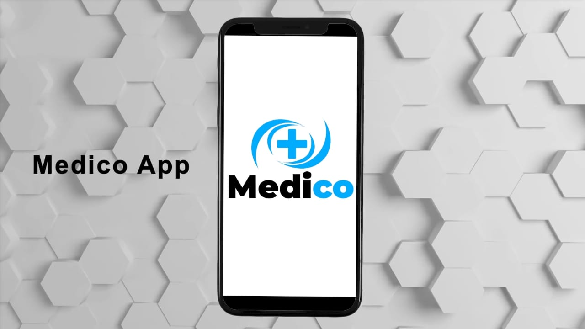
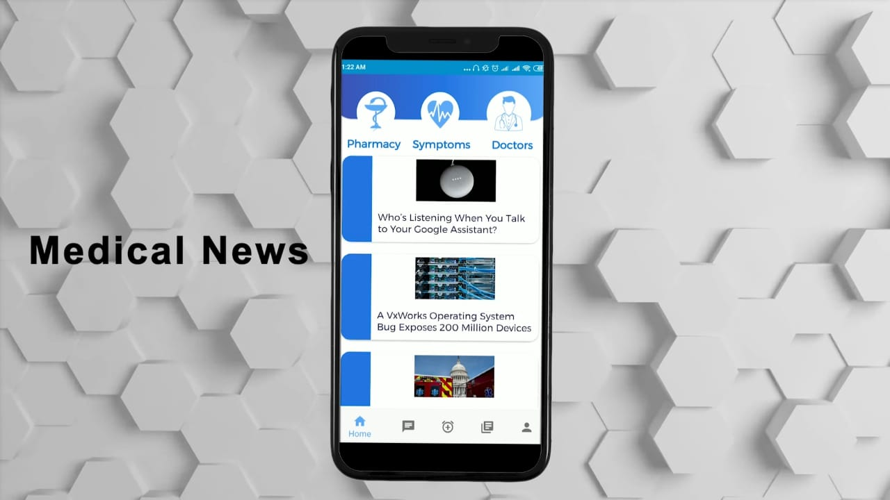
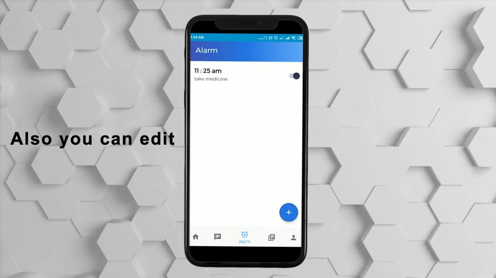
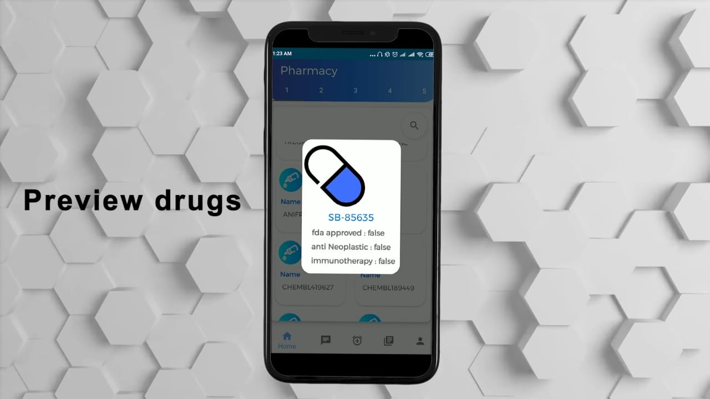
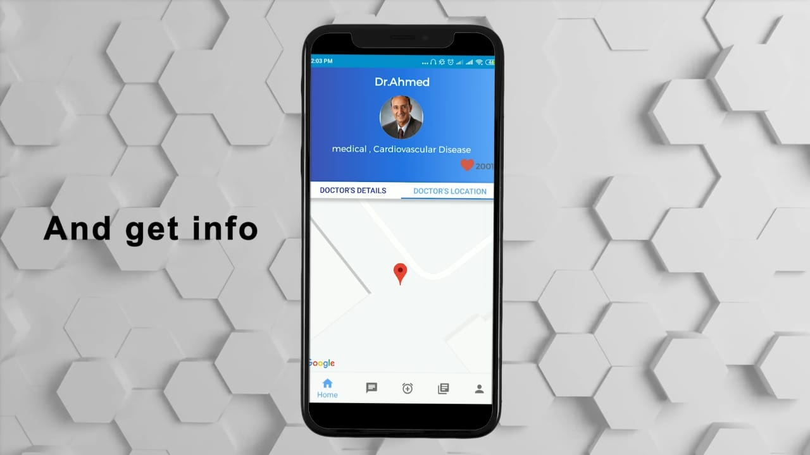
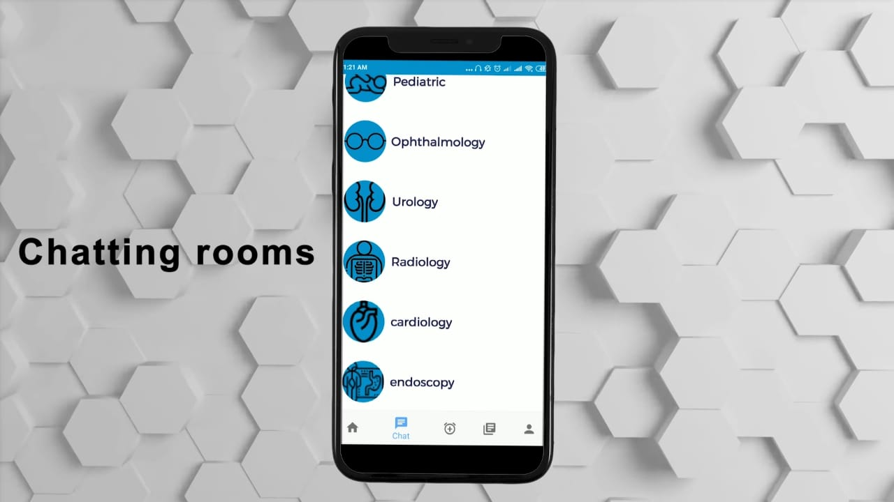
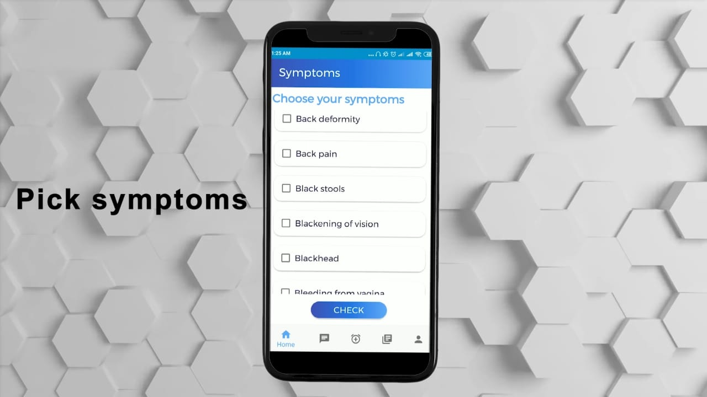
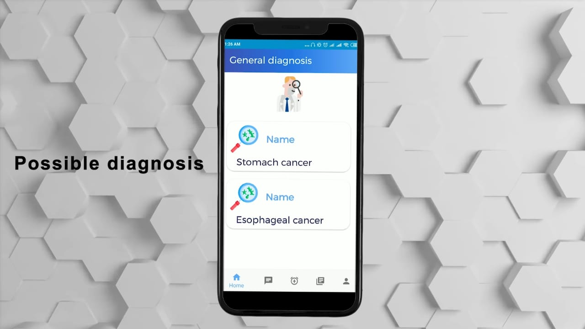

# MEDICO
-android summer competition project 2019
## Covered topics : 
 * MVVM
 * ROOM Database
 * Retriofit
 * BroadCast receiver
 * Firebase (realtime Database)
 * Google maps
 * alarm manger
 
 you can see a simple Blog on [Youtube](https://www.youtube.com/watch?v=Q4R8Wv8khkk)
 
 ## Screen shots
 
 
 
  
   
    
     
      
